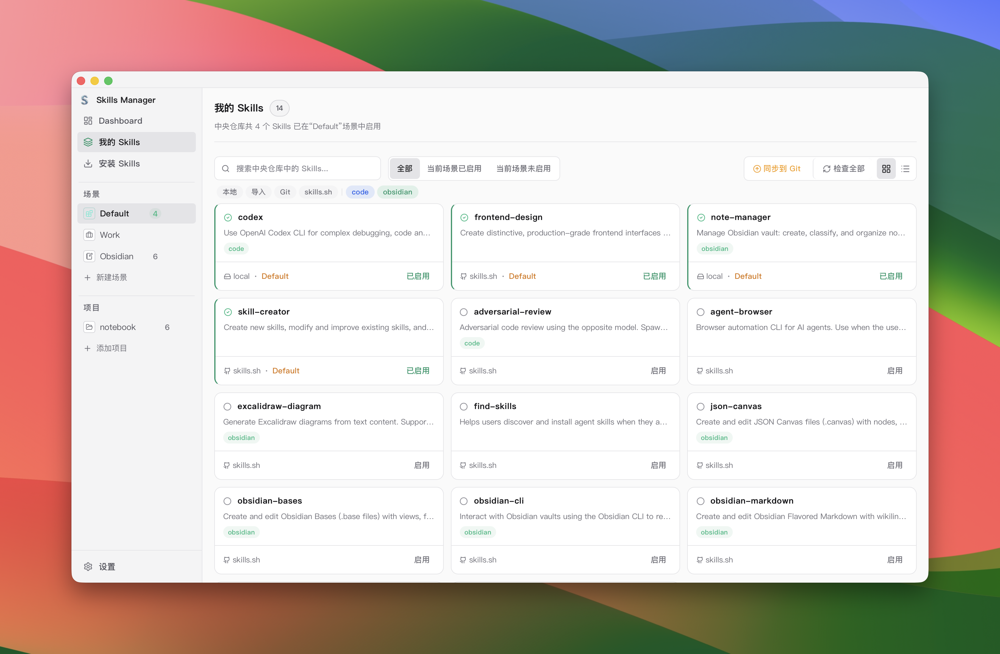
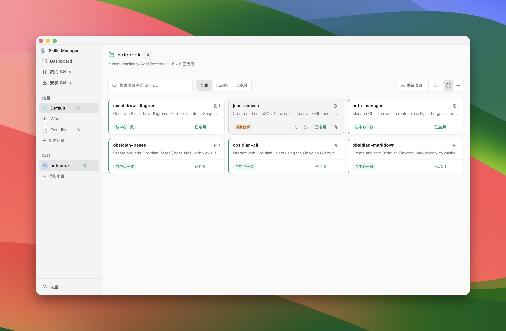

<p align="center">
  
</p>

<h1 align="center">Skills Manager</h1>

<p align="center">
  One app to manage AI agent skills across all your coding tools.
</p>

<p align="center">
  <a href="./README.zh-CN.md">中文说明</a>
</p>

<p align="center">
  
</p>

| My Skills | Project Skills |
|:---------:|:--------------:|
|  |  |

## Features

- **Unified skill library** — Install skills from Git repos, local folders, `.zip` / `.skill` archives, or the [skills.sh](https://skills.sh) marketplace. Everything goes into one central repo at `~/.skills-manager`.
- **Multi-tool sync** — Sync skills to any supported tool via symlink or copy with a single click.
- **Project Skills** — View and manage skills inside either `skills/` (OpenClaw-first) or `.claude/skills/`, with bidirectional sync to your central library.
- **Scenarios** — Group skills into scenarios and switch between them instantly.
- **Skill tagging** — Tag skills and filter by tag for quick lookup.
- **Update tracking** — Check for upstream updates on Git-based skills; re-import local ones.
- **Skill preview** — Read `SKILL.md` / `README.md` docs right inside the app.
- **Git backup** — Version-control your skill library with Git for backup and multi-machine sync.

## OpenClaw Project Layout & Root Selection

### Expected project layout

Skills Manager supports either ecosystem layout per project:

- OpenClaw-style (preferred):
  - `skills/`
  - `skills-disabled/` (optional)
- Claude-style (legacy):
  - `.claude/skills/`
  - `.claude/skills-disabled/` (optional)

### Deterministic precedence rules

1. If both active roots exist, `skills/` is selected (OpenClaw-first).
2. If the preferred root is not active (missing/unreadable) and the alternate root is active, Skills Manager falls back to the alternate.
3. If only disabled roots exist (`skills-disabled/` and/or `.claude/skills-disabled/`), status is `no-active-root`.
4. If no supported roots exist, status is `no-supported-root`.

### Dual-root conflict warning payload

When both ecosystems are active in the same project, API/UI payload includes a warning with:

- `code` (stable machine key)
- `message`
- `severity` (`info|warn|error`)
- `selectedRoot`
- `alternateRoot`

This warning is emitted only for dual-root projects.

### Migration guidance: `.claude/skills` → `skills`

1. Create `skills/` in the project root.
2. Move skill folders from `.claude/skills/` to `skills/`.
3. Move disabled skill folders from `.claude/skills-disabled/` to `skills-disabled/`.
4. Re-open the project in Skills Manager and verify the selected root is `skills/`.
5. Remove old `.claude/skills*` folders after verification.

### Troubleshooting

- **Status `no-active-root`**: create or restore a readable `skills/` (preferred) or `.claude/skills/`.
- **Unexpected fallback**: check directory permissions/readability on the preferred root.
- **Dual-root warning appears**: this is expected when both ecosystems are active; migrate to `skills/` for a single canonical root.

## Git Backup

Back up `~/.skills-manager/skills/` to a Git repo for version history and multi-machine sync.

### Quick setup

1. Create a private repository (recommended).
2. Open **Settings → Git Sync Configuration** and save your remote URL.
3. Open **My Skills**.
4. Choose one:
- Existing remote: click **Start Backup** to clone from the configured remote.
- New local repo: click **Start Backup** to initialize locally, then use **Sync to Git**.
5. Use **Sync to Git** from the My Skills toolbar.

`Sync to Git` automatically handles pull/commit/push based on current repo status.

### Authentication

- SSH URL (`git@github.com:...`): requires SSH key configured on your machine and added to GitHub.
- HTTPS URL (`https://github.com/...`): push usually requires a Personal Access Token (PAT).

> **Note:** The SQLite database (`~/.skills-manager/skills-manager.db`) is not included in Git — it stores metadata that can be rebuilt by scanning the skill files.

## Supported Tools

Cursor · Claude Code · Codex · OpenCode · Amp · Kilo Code · Roo Code · Goose · Gemini CLI · GitHub Copilot · Windsurf · TRAE IDE · Antigravity · Clawdbot · Droid

## Tech Stack

| Layer | Tech |
|-------|------|
| Frontend | React 19, TypeScript, Vite, Tailwind CSS |
| Desktop | Tauri 2 |
| Backend | Rust |
| Storage | SQLite (`rusqlite`) |
| i18n | react-i18next |

## Getting Started

### Prerequisites

- Node.js 18+
- Rust toolchain
- [Tauri prerequisites](https://v2.tauri.app/start/prerequisites/) for your OS

On Windows, use the wrapper below for Rust tests. It auto-loads MSVC build env (`vcvars64.bat`) when needed:

```bash
npm run test:rust
```

### Development

```bash
npm install
npm run tauri:dev
```

### Build

```bash
npm run tauri:build
```

## Troubleshooting

### macOS: "App is damaged and can't be opened"

If you see this error after downloading the app, run the following command in Terminal and then open the app again:

```bash
xattr -cr /Applications/skills-manager.app
```

Replace the path with wherever you placed the `.app` file if it's not in `/Applications`.

## License

MIT
